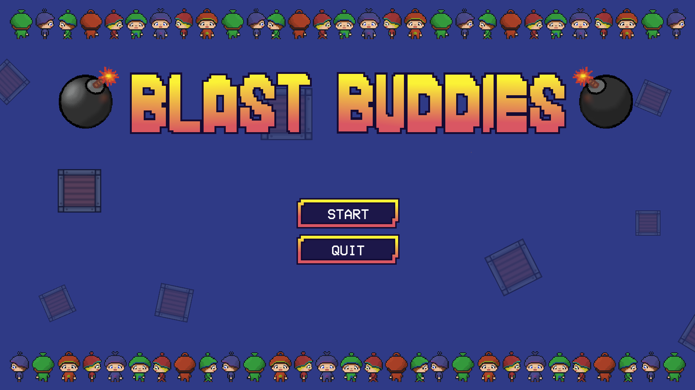
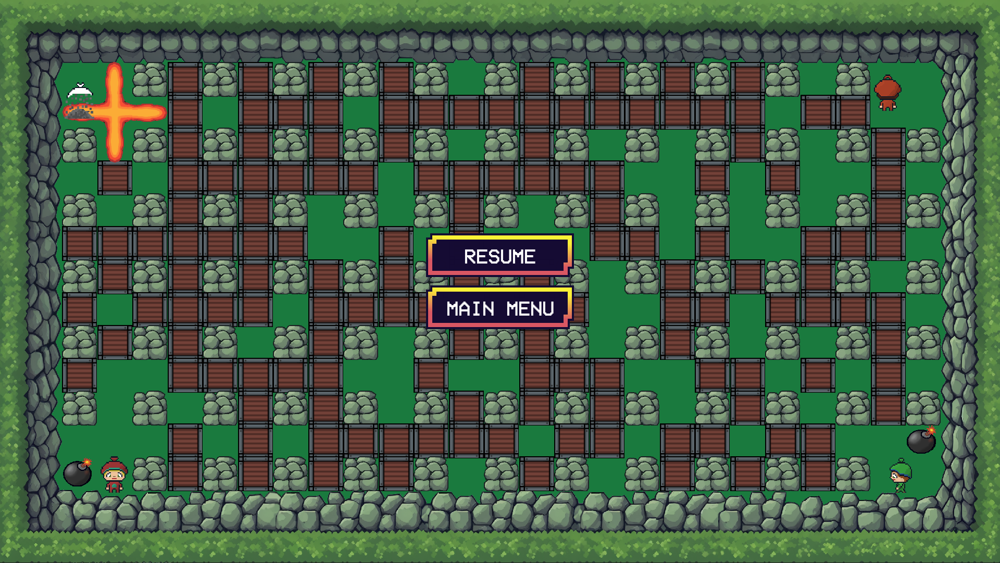

# 💣 Blast Buddies – Bomberman AI

Moderní Python hra inspirovaná Bombermanem s Q-learning AI agenty.

---

## 🚀 Spuštění

### 1. Virtuální prostředí
```bash
python -m venv venv

# Windows
venv\Scripts\activate

# Linux / macOS
source venv/bin/activate
```

### 2. Nainstalování závislostí
```bash
pip install -r requirements.txt
```

> Doporučená verze: **Python 3.11**

### 3. Spuštění hry
```bash
python main.py
```

---

## 🎮 Ovládání

| Klávesa | Akce       |
|---------|------------|
| W       | Pohyb nahoru |
| S       | Pohyb dolů  |
| A       | Pohyb doleva |
| D       | Pohyb doprava |
| SPACE   | Pokládání bomby |

---

## 🏗️ Struktura projektu
```
blast-buddies/
├── main.py              # Vstupní bod hry
├── game.py              # Hlavní herní smyčka
├── map.py               # Generování mapy
├── bomb.py              # Logika bomb
├── RL_agent.py          # Q-learning agent
├── Q_table.py           # Načítání / ukládání Q-tabulky
├── Q_table.json         # Persistentní Q-tabulka
├── Entities/
│   └── ai_player.py     # AI hráč
├── Obstacles/           # Pevné a zničitelné bloky
├── States/
│   └── Game/            # RunningState, PauseState, TitleState
└── Assets/              # Grafika a animace
```

---

## 🤖 AI a Q-learning

- **3 AI agenti** používají Q-learning s rovnováhou průzkumu (exploration) a využití (exploitation)
- Q-tabulka se načítá ze souboru `Q_table.json` a po každé hře se ukládá
- Počet CPU agentů lze upravit ve třídě `RunningState`

---

## 🖼️ Ukázka




---
